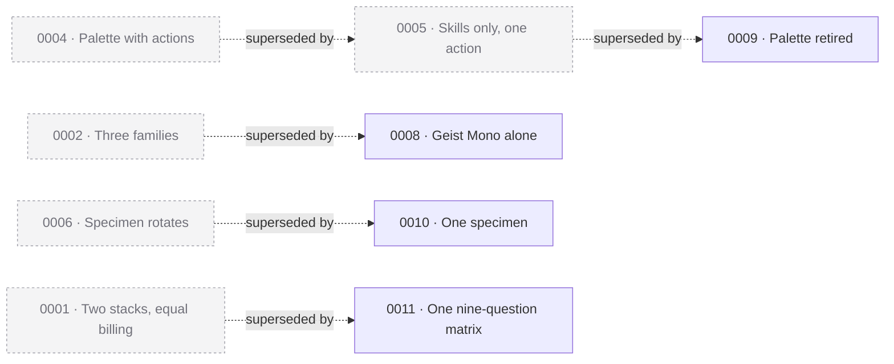

# Design decisions — Why did we choose this?

**Question:** Why did we choose this?
**Tense:** past
**Status:** truth — past tense, append-only
**Written by:** human
**Lifecycle:** **Append-only.** Never edit a logged decision — supersede it with a new one that links back, or append under `## Follow-up`. The only edit ever permitted is the `**Status:**` line.

The answer to *"why is it like this?"* six months later, when everyone who knew has forgotten.

**This tier is separate from [`../../docs/decisions/`](../../docs/decisions/README.md) on purpose.** Architectural and design decisions have different audiences, different evidence, and different readers. An engineer scanning for why the build is configured a certain way should not have to page through rejected nav layouts, and vice versa. See [ADR 0020](../../docs/decisions/0020-design-gets-its-own-stack-not-a-shoehorn-into-docs.md).

## Why this is harder than the architectural log

`decisions-logger` can mine a codebase, because code leaves evidence: commits, diffs, PR threads, a config file that changed on a date. **Design leaves none of it.** A Figma file shows the winner and nothing else.

Which makes the fabrication risk worse here than anywhere else in this repo. In code, an invented rationale can eventually be checked against a diff. **A plausible reason for a layout choice is indistinguishable from a real one to every future reader, forever.** There is nothing to check it against.

So `*(reason not stated)*` is a **first-class outcome**, not a failure. *"We did this, nobody wrote down why"* is exactly what a reader needs to know before they change it.

## What goes here

- One numbered ADR per fork: `NNNN-slug.md`. `0000` is reserved for the reject ledger.
- A named alternative a reasonable person would have chosen — **no loser, no decision.**
- **What we gave up.** Design choices are trades; the traded-away half is the first thing anyone asks about later and the first thing that decays into "that's just how it is."
- **What would make us revisit.** A condition, not a platitude.

## What does NOT go here

- Architectural or process decisions — that's `../../docs/decisions/`.
- A fork still in play — that's the brief's Open questions.
- What was tried — that's the explorations tier.
- An invented rationale. Ever.

## Template

Copy `_TEMPLATE.md`. Run `/design-decisions` to log one.

<!-- BEGIN design-decisions-index -->
## Index

*Generated by `/design-decisions` from the ADR files. Edit the ADRs, not this table.*

| # | Decision | Date | Status | Gave up | Follow-ups |
|---|---|---|---|---|---|
| [0001](./0001-two-stacks-equal-billing.md) | Context engineering for code *and* design, at equal billing | 2026-08-16 | Superseded by [0011](./0011-one-matrix-not-two-parallel-stacks.md) | The tight single-thesis pitch; a clean design-first relaunch later | 1 |
| [0002](./0002-a-three-family-type-system-for-the-site.md) | A three-family type system: Newsreader, Archivo, IBM Plex Mono | 2026-07-19 *(approx.)* | Superseded by [0008](./0008-geist-mono-alone.md) | *(none identified — never articulated)* | 2 |
| [0003](./0003-the-site-follows-the-system-colour-scheme.md) | The site follows the system colour scheme, re-lit rather than inverted | 2026-08-16 | Accepted | The paper metaphor; two palettes to keep honest; deck-divergent accents | 0 |
| [0004](./0004-a-command-palette-with-actions-not-a-search-box.md) | A command palette with actions, not a search box | 2026-08-16 | Superseded by [0005](./0005-the-palette-searches-skills-and-copies-one-thing.md) | A convention people must know; desktop-only actions; ~20KB JS; a second way to reach everything | 2 |
| [0005](./0005-the-palette-searches-skills-and-copies-one-thing.md) | The palette searches skills and copies one thing | 2026-08-16 | Superseded by [0009](./0009-the-command-palette-is-retired.md) | Discovery of tiers and records; a reason to open it when not installing | 2 |
| [0006](./0006-the-hero-specimen-rotates-through-six-skills.md) | The hero specimen rotates through six skills, on a timer | 2026-08-16 | Superseded by [0010](./0010-one-hero-specimen-not-six.md) | The motion spec's absolutism; the undivided single specimen; ~2KB JS; a permanently taller hero | 1 |
| [0007](./0007-the-site-is-terminal-rendered-markdown.md) | The site's visual direction is terminal-rendered markdown | 2026-08-19 | Accepted | The paper metaphor; typographic range; two axes that were never fairly tested | 0 |
| [0008](./0008-geist-mono-alone.md) | The site's type is Geist Mono alone | 2026-08-19 | Accepted | Italic entirely; the zero-webfont page; Latin-only coverage |1 |
| [0009](./0009-the-command-palette-is-retired.md) | The command palette is retired, not rebuilt | 2026-08-19 | Accepted | Search entirely; the evidence 0005 asked for; the keyboard route to the install command |1 |
| [0010](./0010-one-hero-specimen-not-six.md) | The hero shows one specimen; the rotation is retired | 2026-08-19 | Accepted | Five records off the page; range without a click; 0006's own questions, unanswered |1 |
| [0011](./0011-one-matrix-not-two-parallel-stacks.md) | One nine-question matrix replaces the two parallel stack sections | 2026-08-19 | Accepted | Equal billing as a visible thing; the real folder names; a structure that scaled by stack | 0 |

### Supersession

*Only superseded and superseding decisions appear in the graph. 11 decisions logged, 5 superseded, 6 stand — see the table. Four of the five were superseded on the same day, by the rebuild in `git:fcea6dd`: a direction change ([0007](./0007-the-site-is-terminal-rendered-markdown.md)) that reopened every decision made underneath the old one.*

**One supersession crosses tiers and is not in the graph.** [0007](./0007-the-site-is-terminal-rendered-markdown.md) replaces the direction stated in [repo ADR 0017](../../docs/decisions/0017-the-website-design-direction-is-swiss-whitepaper.md), which predates this tier and therefore lives in `docs/decisions/`. The `**Supersedes:**` field points inside this tier only, so the link is carried as a note in 0007 and as a dated Follow-up on 0017.

**Four records carried an unrecorded rationale; three were answered by asking.** On 2026-08-19 the owner supplied reasons for [0008](./0008-geist-mono-alone.md) (Geist Mono is a variable font and reads like a marked-up file), [0009](./0009-the-command-palette-is-retired.md) (the new direction did not call for a palette — retirement for fit, not failure), and [0010](./0010-one-hero-specimen-not-six.md) (the "static gallery" alternative was not recognised, so it was never a weighed option). Each is a dated Follow-up; the frozen text above each is unchanged and still reads `*(reason not stated)*`, because that is what was true when the decision was made.

**One stands unfilled.** [0002](./0002-a-three-family-type-system-for-the-site.md): its alternatives were recovered from the exploration drafts, but why the winner won was never written down and nobody remembers. That is a legitimate and useful record — it tells the next reader they are changing something whose reasoning was never captured, which is not the same as changing something nobody thought about.

**The lesson worth keeping:** three of four gaps closed because somebody asked, four hours after the records were written. A gap is worth marking precisely because it is answerable later; it is not worth inventing a reason to avoid.
<!-- END design-decisions-index -->

Previously declined or filtered: 0. *(No reject ledger yet — `0000-not-logged.md` is created the first time a candidate is rejected.)*
