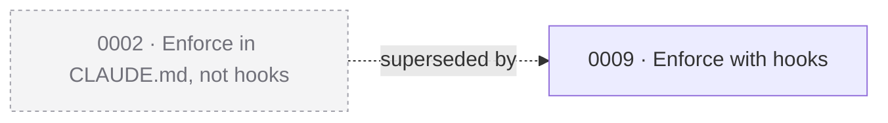

# decisions-logger

Fills the **decisions tier** — the folder that answers *"why did we choose that?"*. It mines a project for choices that were really made, and writes each as a numbered ADR with the evidence it came from.

Decisions are the **truth tier**: past tense, append-only, superseded rather than edited. Which makes this skill's one real risk the whole design problem: **mining a repo for "why we chose X" is exactly where a model invents rationale that sounds right.** A plausible fabricated reason is indistinguishable from a real one to every future reader, and it poisons the tier the rest of the project trusts.

So the guiding rule, inherited from `changelog-tracker`, is **faithful, not generative**: every clause traces to a source or to the user's own words.

Two principles do the work:

- **A candidate may be *born* in a weak source. It may never be *justified* by one.** Some files state a rule and never state its reason (`branch names carry no area segment`). You must be able to *find* those decisions — so you read the file — but their prose can never reach an ADR's reasoning fields. It is a firewall, not a ban.
- **"I don't remember" is always an option.** Every interview question offers it, and it produces a real ADR with the reason recorded as `*(reason not stated)*`. **A decision with an honest gap is worth more than one with a plausible fiction.**

## Instructions

### Step 0 — Detect your surface

Decide where you're running, using **Bash availability**:

- **Claude Code** — Bash works, real filesystem and git. Full flow.
- **Claude.ai** — no filesystem, no git, no existing ADRs to compare against. Degrade: ask the user to paste their decisions index (or say there isn't one), run the interview conversationally, and emit each ADR as a downloadable artifact plus the index region and the CLAUDE.md block to paste. **Say plainly that dedup, supersession detection, and the shipping cross-check are unavailable here — do not guess at them.**

Confirm the repo: `git rev-parse --show-toplevel`. If it fails, the git-anchored sources are gone; say so and degrade (see Step 15).

**Argument modes:**

- *(no argument)* — the default: **everything not yet logged.** Steps 1–14.
- `check` — Steps 1–6 plus a report, with **zero writes**. A lint you can run any time.
- `reconsider` — the default flow, but **ignore the reject ledger for one run**, re-opening everything previously declined or filtered out.
- `"<free text>"` — the **fast path** (Step 3B). The user just made a decision and is naming it. Skip the mine; interview and write one ADR.

### Step 1 — Resolve the decisions path

Reuse `repo-setup`'s resolution order, in descending authority:

1. **A path declared in a CLAUDE.md protocol block** — `skill:repo-setup`'s routing table row for Decisions, or this skill's own block. A declared path beats everything.
2. **An existing folder on disk** — `docs/decisions/`, `docs/adr/`, `adr/`, `architecture/decisions/`, a root `DECISIONS.md`. Match **case-insensitively** (macOS silently reuses `docs/Decisions`).
3. **Canon** — `docs/decisions/`.

If **nothing exists**: do not create it silently. Say the tier is missing and recommend `/repo-setup add decisions` — **`repo-setup` owns the tier's README and `_TEMPLATE.md`**, and authoring them here would be the stale-copy failure that skill explicitly forbids. If the user declines, offer to create just the folder and the ADRs.

Detect the **existing numbering scheme** (`0001-`, `001-`, `ADR-001-`) and **adopt it. Never renumber** — renumbering breaks every inbound link and every supersession edge.

### Step 2 — Load the existing record (the idempotency baseline)

Before mining anything, read:

1. **Every ADR** in the tier — number, title, date, status, `Supersedes`, the `## Evidence` citations, and the normalized claim (below).
2. **`{decisions}/0000-not-logged.md`** — the reject ledger (Step 11). This is what stops rejected candidates resurfacing forever.
3. **The index region** (`<!-- BEGIN decisions-index -->`), if present.

**The normalized claim** is the unit of comparison. Reduce every ADR and every candidate to:

```
{subject} := {chosen option}  ⟂  {rejected option}
```

e.g. `packaging-of-a-skill := folder-carries-its-own-plugin.json ⟂ separate-plugins-tree`

**Dedup and supersession are the same comparison with two outcomes** — build it once:

| Candidate vs. a logged ADR | Outcome |
|---|---|
| same subject, **same** chosen option | **duplicate** → drop |
| same subject, **different** chosen option | **supersession candidate** → Step 9. Never a new standalone ADR. |
| different subject | **new** → proceed |

Cheap pre-pass first: **evidence-anchor overlap.** If a candidate's primary anchor (`path#heading`, `git:hash`) already appears in a logged ADR's Evidence block, presume it's logged; escalate to the semantic comparison only if the claim looks different.

### Step 3 — Mine the sources

#### 3A — The default path (full backfill)

**The tier governs what a source is allowed to contribute.** This table is the most important thing in the skill:

| Tier | Sources | May supply | May **never** supply |
|---|---|---|---|
| **S — primary** | `docs/MODEL-STRATEGY.md` (often has a literal *Why* column) · `handoff/*.md` → `## Decisions Made` (already shaped `{decision} — {why}`, alternatives often named inline) · the tier `README.md`s (argued prose) · **CLAUDE.md narrative prose** — the sections *outside* the protocol markers | claim, why, alternatives, date | — |
| **A — corroborating** | PRD `§Risks`, `§Non-goals`, rationale paragraphs | the *why*, the named alternative | **existence.** A PRD may never be the `Primary:` citation. |
| **B — anchors** | `git log` bodies (non-merge, multi-line) | date, hash, purpose clause, **proof it shipped** | the rejected alternative. Never the sole rationale. |
| **C — index/dating** | `changelog/CHANGELOG.md`, `changelog/commits/*.md` | date, hash, shipping proof | **any rationale.** These are summaries — follow them back. |
| **D — rules, not reasons** | CLAUDE.md `<!-- BEGIN skill:* -->` blocks · `README.md` conventions list · `CONTRIBUTING.md` · `.github/` | **the rule only** — i.e. the fact that a fork happened | **any word** of Context, Alternatives, or Consequences. Firewalled. |
| **X — never mine** | PRD `§Open questions for v2` (unresolved ≠ decided) · `{decisions}/` itself | — | everything |

Three invariants follow, one per failure mode:

**Invariant 1 — No confabulation.** Every sentence in Context / Alternatives / Consequences traces to Tier S, A, B, or a user answer. **Tier C and D prose may never be paraphrased into those sections.** A candidate whose *only* source is Tier D is stamped `WHY: NOT STATED` **by construction** and routed to the interview — it cannot be written from mined text at all.

> Why this matters: a block that says *"Branches follow `<type>/<slug>`. **No area segment.**"* reads exactly like a decision and contains **zero reasoning**. A model that reads it will produce a beautiful, confident, entirely fabricated Context paragraph. The ban has to be on the *destination fields*, not on reading the file — because you must read it to find the candidate at all.

**Invariant 2 — Proposal ≠ truth.** An ADR requires **shipping evidence**: a Tier B commit, a Tier C changelog entry, or the artifact existing on disk. **A PRD alone is never enough** — a PRD describes what *should* be true.

**Invariant 3 — Exactly one Primary, ranked by originality, not recency.** If two sources carry the same claim, the primary is **the one the other is describing.** A changelog entry that summarizes `docs/MODEL-STRATEGY.md` is *more recent* and is **not** the source — follow the link and cite the file, not the summary of it. Recency is precisely the wrong tiebreak.

#### 3B — The fast path (`/decisions-logger "<the decision>"`)

No mining. The evidence is **this session**: the diff, the conversation, the user's own words. Confirm the claim, ask for the loser and the cost, **still run the Step 2 dedup** (a milestone is the *most* likely moment to re-log something already in the folder), write one ADR, rebuild the index.

Offer this **before staging the commit**, so the ADR lands alongside the change it explains.

### Step 4 — The significance filter, and granularity

#### The significance filter — two gates

**Gate 1 — The Fork Test (hard gate). Name the loser.**

Can you name a *specific alternative that a reasonable person would have chosen*? If not, this is a **fact, a task, or a chore** — not a decision. This gate is not overridable by anyone's enthusiasm.

- *"Added a `.gitignore` for OS cruft"* → the loser is "commit `.DS_Store`". Nobody would defend it. **Fail.**
- *"Skill folder is also the plugin"* → the loser is a separate `plugins/` tree. Real, defensible, common. **Pass.**

**Gate 2 — Blast radius.** Reversal must touch **more than one file, or force a second decision.** Removing a `.gitignore` line is one edit. Reversing `handoff/` → `docs/handoffs/` after files exist means a rename, a README note, a CLAUDE.md block, and a skill's write path. That's the line.

**Two collapse rules that remove most of the noise:**

- **Policy, not instance.** A source line recording *compliance* with a rule is not a decision — **the rule is.** *"Committed on `feat/x`, not directly on `prod-stable`"* is an instance; the ADR is the policy (*"`prod-stable` is the protected default branch"*), whose reason may well not be stated anywhere. Collapse instances upward.
- **Fact, not choice.** *"This project makes no model calls of its own"* is a fact about the repo, not a fork. Drop.

Everything filtered out is written to the reject ledger as `below-bar` — **that is what makes the filter idempotent** instead of re-running its own judgment every time.

#### Granularity — one fork, one ADR

**The test is independent reversal:** could you reverse rule A without re-opening rule B? If reversing *"Sonnet for plumbing"* forces you to re-examine *"Opus is the default"*, they are **one decision**.

Two mechanical corollaries:

- If two candidates would share the same **Context** paragraph, or the same **Alternatives** list → one ADR.
- If the title needs an **"and"**, or is a comma-list of four things → you have more than one ADR, *or* you haven't found the principle. Name **the principle**, not the list.

So a model-strategy document yielding *"Opus default / Sonnet plumbing / Fable break-glass / Haiku never"* is **one ADR, not four** — those are four rows of a single routing policy, sharing one Context and one rationale spine. Its mandatory-review rule, however, is a **separate** ADR: independently reversible, its own stated why.

**Anti-rule: co-location is not co-reasoning.** Never merge two decisions because they landed in the same commit or the same document.

### Step 5 — Dedup against the record

Run the Step 2 comparison against **both** ledgers. Against `0000-not-logged.md`, by class:

| Class | Re-proposed? |
|---|---|
| `below-bar` — the filter rejected it | **Never** (unless `reconsider`) |
| `declined` — the user said no | **Never** (unless `reconsider`, or the user deletes the row) |
| `deferred` — the user said *not now* | **Yes**, but demoted to a footnote, never the main table |
| `unshipped` — a proposal with no shipping evidence | **Automatically, once shipping evidence appears.** Invariant 2 clears itself. |

The `declined` / `deferred` split is the humane part: **"no" is permanent; "not now" is a snooze.** That is what stops rejected candidates reappearing on every run forever.

**Always print the suppression count**, even when nothing was suppressed:

```
Previously declined (not re-proposed): 3 — see 0000-not-logged.md.
Run /decisions-logger reconsider to re-open them.
```

Suppression the user can't see is indistinguishable from a bug.

### Step 6 — Present the candidates (the propose gate)

**Nothing is written before this.** One ranked table — claim (with its loser), primary evidence, and a why-verdict on every row:

```
Decision candidates — 22 found · 18 with a stated "why" · 4 without

| #  | Decision (the claim, with its loser)                              | Primary evidence                          | Why?                   |
|----|-------------------------------------------------------------------|-------------------------------------------|------------------------|
| 1  | Each skill folder is also a plugin — over a separate plugins/ tree | handoff/…-build-publish.md §Decisions Made| STATED                 |
| 2  | Enforce conventions via CLAUDE.md blocks, not git hooks            | CLAUDE.md §Skill protocols (narrative)     | STATED                 |
| …  |                                                                   |                                           |                        |
| 19 | Branch names carry no area segment — over feat/<area>/<slug>       | CLAUDE.md skill:branch-naming (Tier D)     | NOT STATED — will ask  |

Below the bar (recorded in 0000-not-logged.md, not proposed again):
  • Added a .gitignore for OS cruft — no loser (Fork Test)
  • "Committed on feat/… not prod-stable" — an instance; collapsed into #19's sibling

Previously declined (not re-proposed): 0
```

Then **one** AskUserQuestion: **Write all with a stated why** / **Select individually** / **Cancel**. **Do not fire twenty AskUserQuestions.** Reason-less candidates are never in this batch — they go to Step 7 by construction.

### Step 7 — Interview the gaps (never invent a why)

Only for `NOT STATED` rows. Cap at **4 questions per round.** For each, show the rule, the loser you inferred, and ask:

> `skill:branch-naming` says branches are `<type>/<slug>` with **no area segment**. The alternative was `feat/<area>/<slug>`. The reason isn't written anywhere I can find. Why no area segment?
>
> **(a)** I'll tell you · **(b)** I don't remember — log it as *(reason not stated)* · **(c)** Skip for now · **(d)** Don't log this

Three honest outcomes:

- **(a)** → `**Rationale:** supplied by {user} on {date} (not written down at the time)`. **That provenance line matters** — a reason reconstructed years later is not the same artifact as one recorded in the moment, and the record should say so.
- **(b)** → write the ADR with the alternative **named** and the reason literally `*(reason not stated)*`. Context describes **what was true**, never a motive. **This is a legitimate and valuable ADR** — *"we did this, nobody wrote down why"* is exactly what a reader needs to know before they change it.
- **(c)/(d)** → the reject ledger, class `deferred` / `declined`.

**Hard rule: option (b) must appear on every question.** The moment "I don't know" isn't offered, the model fills the gap. This is the single most important choice in the skill.

### Step 8 — Write the ADRs

- **Numbering:** 4-digit, zero-padded, from `0001`. **`0000` is reserved** for the reject ledger, which also keeps it out of the sequence.
- Next = highest existing prefix + 1. **Re-scan immediately before each write, bump on collision, never overwrite.**
- **Never reuse a burned number**, even if an ADR file was deleted. A burned number is cheaper than a broken link.
- **Slug:** kebab-case of the decision statement, ≤ 60 chars → `0002-enforce-conventions-in-claude-md-not-git-hooks.md`.
- **Date = when the decision was MADE**, taken from the evidence (the handoff's date, the commit's date) — **not today.** If only the earliest evidence date is available, use it and mark `(approx.)`. Today's date appears only in Follow-up entries and the reject ledger. *Backfilling with `date +%F` destroys the chronology the supersession graph depends on.*
- If the folder has a **pre-existing template** with different sections, adopt it. Never rewrite existing ADRs to match a new one.

### Step 9 — Supersession

**The rule, stated precisely:** append-only applies to the *reasoning*, not the *pointers*. The frozen region is **Context / Decision / Alternatives / Consequences** — the record of what was thought at the time. The **Status line is navigational**: it says where this file sits relative to the rest of the record. Updating a pointer is not rewriting history. *Refusing to update it is hiding history* — a superseded ADR still reading **Accepted** is lying to the next reader.

**Exactly two mutations of an existing ADR are ever permitted:**

1. **The Status line** — `**Status:** Accepted` → `**Status:** Superseded by [0009](./0009-….md)`.
2. **An append under `## Follow-up`.**

**Enforce this by mechanism, not by intention:** read the file, split it into (Status line) + (frozen body) + (Follow-up section), and **assert the frozen body is byte-identical** to what you read. If it isn't, abort and report. "Be careful" is not a mechanism.

The superseded ADR **also** gets a dated Follow-up entry:

```md
- **2026-08-01** — Superseded by [0009](./0009-enforce-via-hooks.md). Reason: {why now}. Evidence: `git:abc1234`.
```

So the **authoritative forward link lives in the append-only region**, and the Status line is a derived cache of it. The index can be rebuilt from Follow-up entries alone — nothing load-bearing depends on the one edit we allow.

Mechanics:

- The new ADR carries `**Supersedes:** [0003](./0003-….md)`.
- **Never auto-supersede.** Always confirm, and **require the user to state the *why now*** — the reason a decision changed is the most valuable sentence in the new ADR, and it is almost never in any source.
- **No "partially superseded."** If the new decision changes *any part* of the old Decision section, the old one is Superseded, full stop, and the new ADR **restates** the parts that carry over. A partial status makes the graph a lie and forces every reader to mentally patch a frozen file.
- **One edge type only** (`Supersedes`). No `Amends`, no `Relates to`. A graph with four edge types communicates nothing.

### Step 10 — Follow-ups (the impact mechanism)

For each **Accepted** ADR, scan for evidence **newer than its date**. **Exactly four triggers** justify a Follow-up — being strict here is what stops the section becoming a dumping ground:

1. **A predicted consequence materialized** (or conspicuously failed to). The ADR warned *"no guarantee the protocol fires — there's no hook"*; a later handoff reports the changelog was missed for three commits. The ADR was right, and the record should say the bill came due.
2. **The scope widened without the decision changing.** An ADR decided something for *one* skill; a later commit applied it to three more. The decision didn't change — its **reach** did. **This is the most common legitimate Follow-up and the main reason the section exists.**
3. **A premise in the Context expired.** The Context said *"the repo is private"*; it went public. The decision may still stand, but its premise moved and the next reader must know before relying on it.
4. **Practice drifted from the record.** The code no longer matches the ADR and nobody superseded it. **This is the loud one:** emit the Follow-up recording the drift **and** raise a supersession candidate as a separate item. Never let drift pass as "just a follow-up."

**Not a Follow-up:** restating the decision; a *new* decision (that's a new ADR); a supersession (Step 9); anything undated or without an evidence citation.

Follow-ups are proposed at the **same gate** as ADRs, with their evidence, and never appended silently. The frozen-body byte-check applies to every append.

### Step 11 — Write the reject ledger

`{decisions}/0000-not-logged.md` — **a prose table in git, not a hidden cache.** A machine-readable JSON blob inside a folder whose README says *"human, past tense, append-only"* is a foreign object: it gets gitignored, it gets lost, and the user can't see or correct it. **The record of what we chose not to record is itself part of the record.**

```md
# 0000. Not logged

Candidates the decision log deliberately does not contain — so a re-run doesn't propose them again, forever.

**This is a ledger, not a decision.** Unlike its numbered siblings it is *hand-editable*: delete a row to make a candidate eligible again, or run `/decisions-logger reconsider` to re-open everything here for one run.

| Date | Candidate (the claim) | Primary evidence | Class | Why not |
|---|---|---|---|---|
| 2026-07-13 | Added a `.gitignore` for OS/editor cruft | `handoff/…-build-publish.md` §Decisions Made | below-bar | No loser — nobody would defend committing `.DS_Store`. A fact, not a fork. |

**Classes** — `below-bar` (failed the Fork or blast-radius test) · `declined` (the user said no) · `deferred` (the user said *not now* — re-proposed as a footnote) · `unshipped` (a proposal with no shipping evidence — re-proposed automatically once evidence appears).
```

### Step 12 — Rebuild the index

**`repo-setup` owns `docs/decisions/README.md`; this skill owns a marker-delimited region of it.** There's no real conflict — `repo-setup` is additive-only and writes that README only if it's absent.

Use `<!-- BEGIN decisions-index -->` … `<!-- END decisions-index -->` — deliberately **not** the `skill:*` namespace, which is reserved for CLAUDE.md protocol blocks. Different payload, different namespace; reusing the literal string invites a grep-based tool to clobber one with the other.

Rules:

- **The region is generated and fully rewritten every run.** It's derived data, like `changelog/CHANGELOG.md` — not prose. **Everything outside the markers is never touched.**
- **First run** (no markers): ask, then append the region at the **end** of the README under an `## Index` heading. Never reorder existing prose.
- **If the README is absent:** do **not** stub it — that's `repo-setup`'s file. Write the same region to `{decisions}/INDEX.md`, say so, and recommend `/repo-setup add decisions`.
- **If the marker exists in both files:** report the conflict, write neither, don't guess.

Region content:

````md
<!-- BEGIN decisions-index -->
## Index

*Generated by `/decisions-logger` from the ADR files. Edit the ADRs, not this table.*

| # | Decision | Date | Status | Supersedes | Follow-ups | Primary source |
|---|---|---|---|---|---|---|
| [0001](./0001-each-skill-folder-is-also-a-plugin.md) | Each skill folder is also a plugin | 2026-07-12 | Accepted | — | 1 | `handoff/…-build-publish.md` |
| [0002](./0002-enforce-conventions-in-claude-md-not-git-hooks.md) | Enforce conventions in CLAUDE.md, not git hooks | 2026-07-12 | Superseded by [0009](./0009-….md) | — | 2 | `CLAUDE.md` §Skill protocols |
| [0007](./0007-branch-names-carry-no-area-segment.md) | Branch names carry no area segment | 2026-07-12 *(approx.)* | Accepted | — | 0 | *(reason not stated)* |

### Supersession



*Only superseded and superseding decisions appear in the graph. 12 decisions stand unsuperseded — see the table.*
<!-- END decisions-index -->
````

Two rules for the graph and the table:

- **Render only the connected components.** Eighteen floating boxes is not a graph. The graph exists to show *drama*; the table shows *inventory*. **If there are no supersessions at all, omit the Mermaid block entirely** rather than emit an empty graph.
- **Keep the Follow-ups count column.** A decision with four follow-ups is a decision **under pressure**, and that should be legible at a glance — it's the earliest warning that a supersession is coming.

### Step 13 — Register the protocol in CLAUDE.md

Idempotent registration (Claude Code only; on Claude.ai, print the block to paste):

1. Locate CLAUDE.md: `git rev-parse --show-toplevel` → `<root>/CLAUDE.md` (accept `.claude/CLAUDE.md`; prefer existing).
2. **Exists** → Read; search for the literal `<!-- BEGIN skill:decisions-logger -->`. Absent: show the block, ask (AskUserQuestion), insert under `## Skill protocols` (create the heading if needed), never blind-append. Present: update in place only if changed; else "already registered." Don't touch other skills' blocks.
3. **Missing** → don't stub; offer a full `/init`-style analysis (confirmation-gated), then insert.

Canonical block:
```md
<!-- BEGIN skill:decisions-logger -->
### Decision log
Architectural and process decisions live in `docs/decisions/` as numbered ADRs (`NNNN-slug.md`), indexed in `docs/decisions/README.md`. The tier is **truth**: past tense, **append-only**. Never edit a logged decision — supersede it with a new ADR that links back, or append a dated entry under its `## Follow-up` section. The only edit ever permitted to an existing ADR is its `**Status:**` line.

**Proactively offer to log — don't wait to be asked.** When a decision has just been made and is about to become invisible, name it, cite the evidence, and offer to write it: **before staging a commit** that changes a convention, a dependency, a layout, or a protocol; **at the end of a substantial piece of work**; when a handoff's `## Decisions Made` section is non-empty; or when the user says "let's go with X" / "not Y, because Z". Offer **once**, be specific, and take no for an answer.

**Never invent a rationale.** If the reasoning isn't in a source, ask — and if nobody remembers, write `*(reason not stated)*`. A decision with an honest gap is worth more than one with a plausible fiction. Run `/decisions-logger` to mine the project for decisions not yet logged.
<!-- END skill:decisions-logger -->
```

### Step 14 — Confirm back

Report: every ADR written (number, title, path); every Follow-up appended and to which ADR; every supersession, showing both edits; the index region rewritten; the reject-ledger rows added, by class; and **every candidate not proposed, with the reason**. If a lot was written, suggest a dedicated commit — and note that it will trip the changelog protocol, which is **expected, not a loop**.

### Step 15 — Edge cases

- **Zero new candidates** — "Decision log is current. Nothing to log." Stop. **Never manufacture an ADR to justify the run.**
- **The decisions tier doesn't exist** — never create it silently. Point at `/repo-setup add decisions`; offer folder + ADRs only if the user declines.
- **Pre-existing ADRs on a different template** (no Evidence, no Follow-up) — **adopt them. Never retrofit sections into them**; that's an edit to a frozen file. New ADRs use the new template; old ones keep theirs. Appending a Follow-up is always legal. Parse them for dedup best-effort, and **say so when you can't**.
- **Existing numbering is `001-` or `ADR-001-`** — adopt the on-disk scheme. Never renumber. **Never reuse a number burned by a deleted file.**
- **Not a git repo** — Tiers B and C are gone. Say so. The shipping cross-check (Invariant 2) weakens to file-existence-on-disk; flag every PRD-sourced candidate as lower-confidence.
- **A candidate whose "why" is aspirational** (*"…because it will be faster"*) — that's a **prediction, not a rationale**. Either it shipped and the prediction is a *Consequence*, or it didn't and this is still a PRD.
- **A PRD-only candidate with no shipping evidence** — never write it. Park it as `unshipped`; it re-proposes itself the day the changelog or the filesystem corroborates it.
- **The same decision recorded in two handoffs** — dedupe, and **date it from the earliest evidence**, not the latest mention. A decision is dated when it was *made*.
- **An evidence file was later deleted or moved** — the citation dangles. **Do not fix it by editing** (frozen). Note it under Follow-up. *This is exactly why the template demands a short verbatim quote alongside the path: paths rot, the ADR is forever.*
- **Two live ADRs that contradict each other, neither superseding** — report **loudly**, propose the supersession, and **never silently reconcile them.** This is the failure the whole tier exists to prevent.
- **Mining your own output** — `{decisions}/` is never an evidence source. (The direct analog of changelog-tracker's changelog-only filter: don't chase your own tail.)
- **A huge backfill (18+)** — one table, one batch confirm, interview capped at 4 per round. Offer to write the stated-why ones now and defer the reason-less ones to a second pass. **Don't hold eighteen ADRs hostage to four unanswered questions.**
- **`docs/` is a published website** — the ADR set ships to production. Inherit `repo-setup`'s warning and its `TEMPLATE.md` (no leading underscore) accommodation.
- **Case-insensitive filesystem** — `docs/Decisions` may already exist. Match case-insensitively; adopt the on-disk casing.
- **User cancels at the gate** — print the ADRs inline, write nothing. A legitimate outcome, not a failure.
